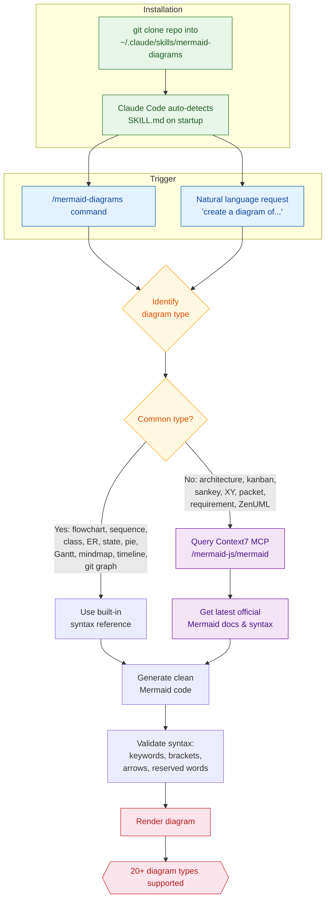

# Mermaid Diagrams Skill for Claude Code

A [Claude Code](https://docs.anthropic.com/en/docs/claude-code) skill that creates Mermaid diagrams using up-to-date syntax from the official Mermaid docs via Context7 MCP.

Supports flowcharts, sequence diagrams, class diagrams, state diagrams, ER diagrams, Gantt charts, pie charts, mindmaps, timelines, git graphs, quadrant charts, C4 architecture diagrams, sankey diagrams, XY charts, block diagrams, packet diagrams, kanban boards, requirement diagrams, user journey maps, and more.

## Installation

Clone this repo into your Claude Code skills directory:

```bash
git clone https://github.com/Liviofrol/mermaid-diagrams.git ~/.claude/skills/mermaid-diagrams
```

That's it. Claude Code automatically picks up skills from `~/.claude/skills/`.

## Prerequisites

This skill works best with a **Context7 MCP server** configured in Claude Code, which it uses to look up the latest Mermaid syntax. The skill still works without it, but Context7 enables querying official docs for newer or less common diagram types.

## Usage

In Claude Code, use the slash command:

```
/mermaid-diagrams [description]
```

Examples:

```
/mermaid-diagrams a flowchart showing user authentication
/mermaid-diagrams ER diagram for a blog with users, posts, and comments
/mermaid-diagrams kanban board with backlog, in progress, and done columns
/mermaid-diagrams sequence diagram of an OAuth2 authorization code flow
```

Or just ask Claude to create a Mermaid diagram in natural language — the skill triggers automatically when a diagram request is detected.

## How It Works



## What's Included

- `SKILL.md` — The skill definition with full Mermaid syntax reference covering 20+ diagram types, styling/theming guidance, and instructions for using Context7 to look up latest syntax.

## Updating

Pull the latest changes:

```bash
git -C ~/.claude/skills/mermaid-diagrams pull
```

## Uninstalling

Remove the skill directory:

```bash
rm -rf ~/.claude/skills/mermaid-diagrams
```
