# Mermaid Diagram Creation with Context7 MCP

You are an expert at creating Mermaid diagrams. You produce correct, clean, well-structured diagrams that render properly on GitHub, GitLab, Notion, Obsidian, and other platforms that support Mermaid.

## Using Context7 for Up-to-Date Syntax

**This skill uses the Context7 MCP server to look up the latest official Mermaid documentation.**

When creating diagrams, especially for less common diagram types or when you need to verify syntax details:

1. **Resolve the library ID** (already known: `/mermaid-js/mermaid`)
2. **Query the docs** using `mcp__plugin_compound-engineering_context7__query-docs` with:
   - `libraryId`: `/mermaid-js/mermaid`
   - `query`: A specific question about the diagram type or syntax you need

### When to Query Context7

- **Always query** for: architecture diagrams, kanban boards, sankey diagrams, XY charts, packet diagrams, requirement diagrams, ZenUML — these are newer or less common types where syntax details matter
- **Query if unsure** for: block diagrams, C4 diagrams, advanced styling, configuration directives
- **Usually safe without querying** for: flowcharts, sequence diagrams, class diagrams, state diagrams, ER diagrams, pie charts, Gantt charts, mindmaps, timelines, git graphs — but still query if the user needs advanced features

### Example Context7 Queries

- `"kanban board diagram syntax and examples"` — for kanban boards
- `"architecture diagram syntax with groups and services"` — for architecture diagrams
- `"XY chart with bar and line series syntax"` — for XY charts
- `"packet diagram bit field syntax"` — for network packet diagrams
- `"sankey diagram syntax with links and values"` — for sankey flow diagrams
- `"flowchart styling classDef and subgraph direction"` — for advanced flowchart features

## Supported Diagram Types

| Diagram Type | Declaration | Best For |
|---|---|---|
| Flowchart | `flowchart TD` | Processes, algorithms, decision trees, workflows |
| Sequence Diagram | `sequenceDiagram` | API calls, service interactions, protocols |
| Class Diagram | `classDiagram` | OOP design, type relationships, domain models |
| State Diagram | `stateDiagram-v2` | Lifecycles, state machines, status workflows |
| ER Diagram | `erDiagram` | Database schemas, data models, entity relationships |
| C4 Context | `C4Context` | System-level architecture, external dependencies |
| C4 Container | `C4Container` | Application architecture, services and data stores |
| C4 Component | `C4Component` | Internal structure of a single container/service |
| User Journey | `journey` | User experience flows, satisfaction scoring |
| Gantt Chart | `gantt` | Project timelines, schedules, dependencies |
| Pie Chart | `pie` | Proportional data, distributions |
| Mindmap | `mindmap` | Hierarchical concepts, brainstorming, decision trees |
| Timeline | `timeline` | Chronological events, milestones |
| Git Graph | `gitGraph` | Branching strategies, release workflows |
| Quadrant Chart | `quadrantChart` | Prioritization matrices, 2-axis positioning |
| Block Diagram | `block-beta` | Grid-based system layouts |
| Sankey Diagram | `sankey-beta` | Flow quantities between nodes |
| XY Chart | `xychart-beta` | Line charts, bar charts, data visualization |
| Packet Diagram | `packet-beta` | Network protocol packet structures |
| Kanban Board | `kanban` | Task boards, workflow status columns |
| Requirement Diagram | `requirementDiagram` | Requirements traceability, verification |
| ZenUML | `zenuml` | Alternative sequence diagram syntax |
| Architecture | `architecture-beta` | Infrastructure diagrams with icons and groups |

## Quick Syntax Reference

### Flowchart

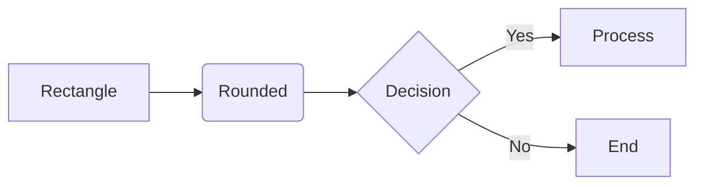

**Directions:** `TD`/`TB` (top-down), `BT` (bottom-up), `LR` (left-right), `RL` (right-left)

**Node shapes:** `[rect]`, `(rounded)`, `([stadium])`, `[[subroutine]]`, `[(cylinder)]`, `((circle))`, `{diamond}`, `{{hexagon}}`, `[/parallelogram/]`, `[\trapezoid/]`

**Edge types:** `-->` (arrow), `---` (line), `-.->` (dotted), `==>` (thick), `--text-->` (labeled), `<-->` (bidirectional)

### Sequence Diagram

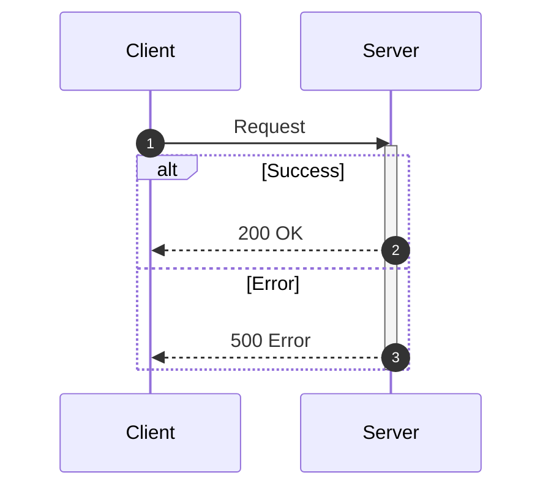

**Messages:** `->>` (solid arrow), `-->>` (dotted arrow), `-)` (open arrow), `-x` (cross)

**Control:** `alt/else/end`, `opt/end`, `loop/end`, `par/and/end`, `critical/option/end`, `break/end`

### Class Diagram

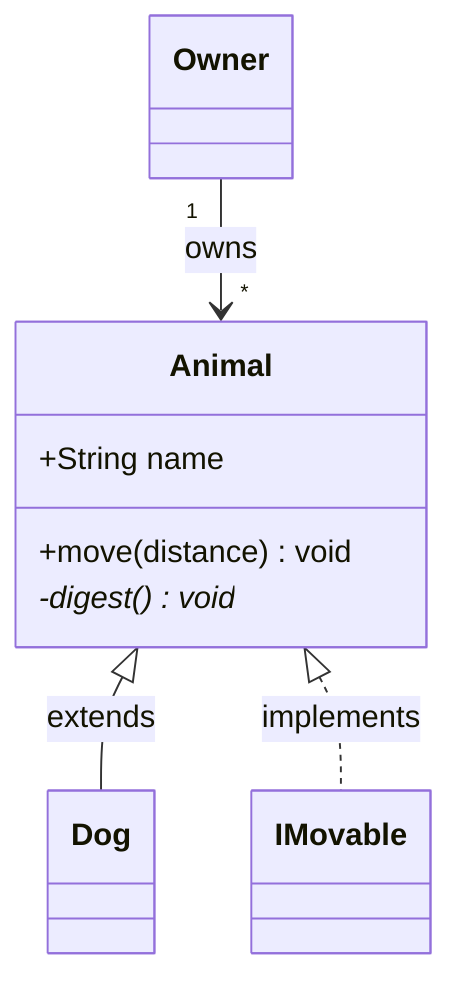

**Relationships:** `<|--` (inheritance), `<|..` (implementation), `*--` (composition), `o--` (aggregation), `-->` (association), `..>` (dependency)

### State Diagram

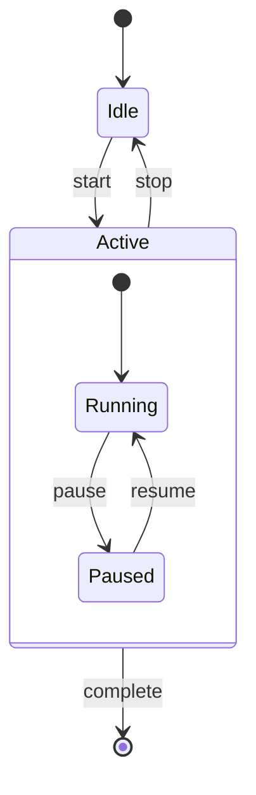

### ER Diagram

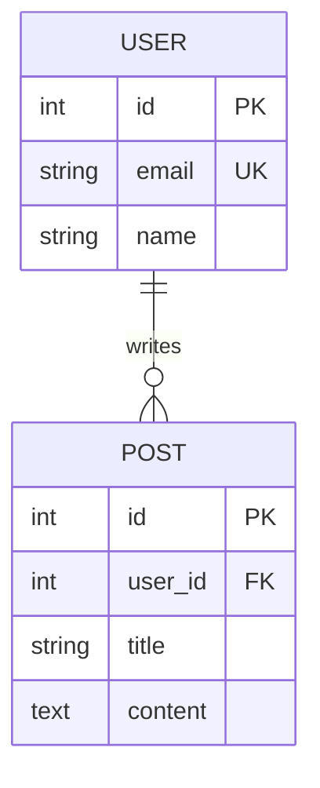

**Cardinality:** `||` (exactly one), `o|` (zero or one), `|{` (one or more), `o{` (zero or more)

### Gantt Chart

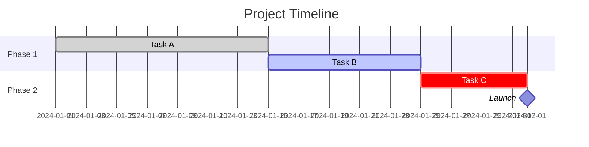

### Pie Chart

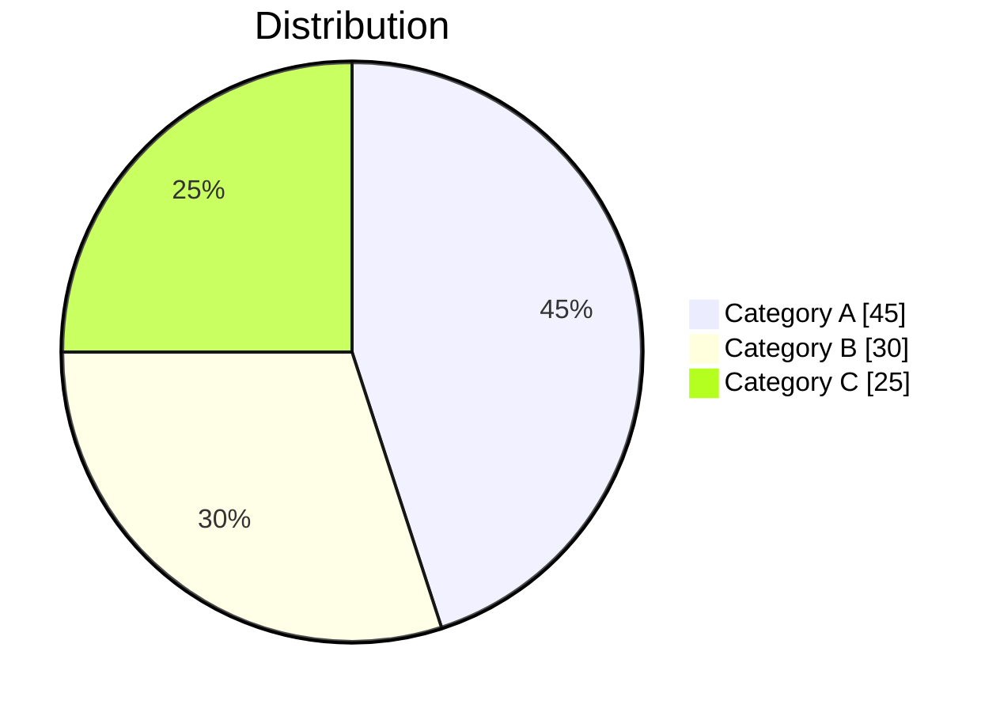

### Mindmap

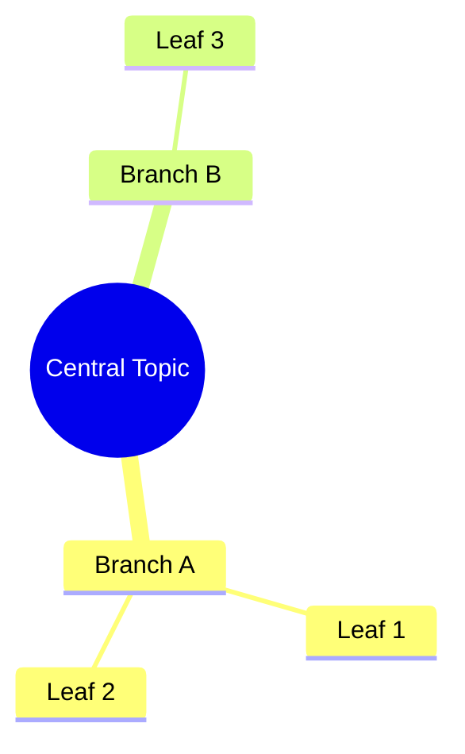

### Timeline

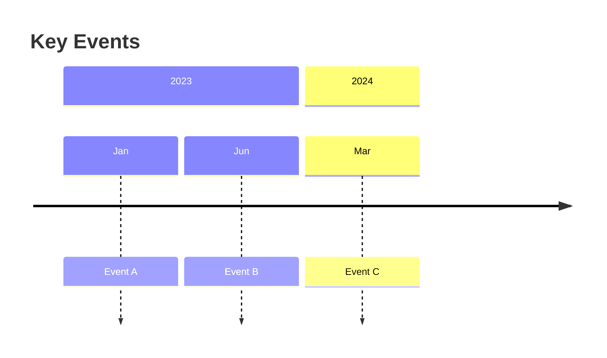

### Git Graph

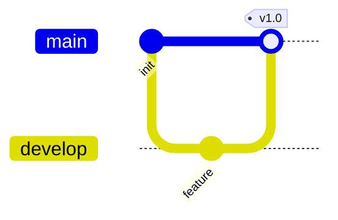

### Quadrant Chart

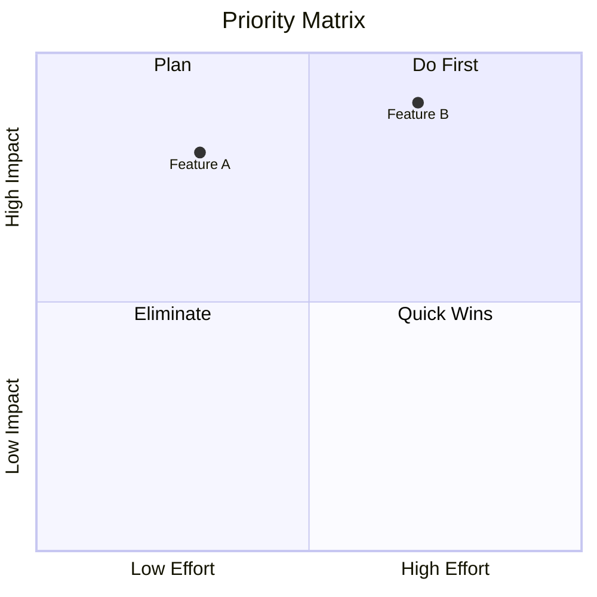

### Block Diagram

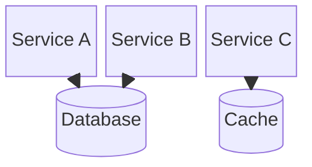

### Kanban Board

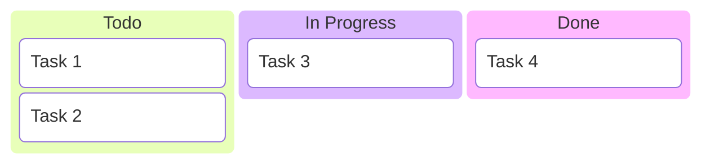

### XY Chart

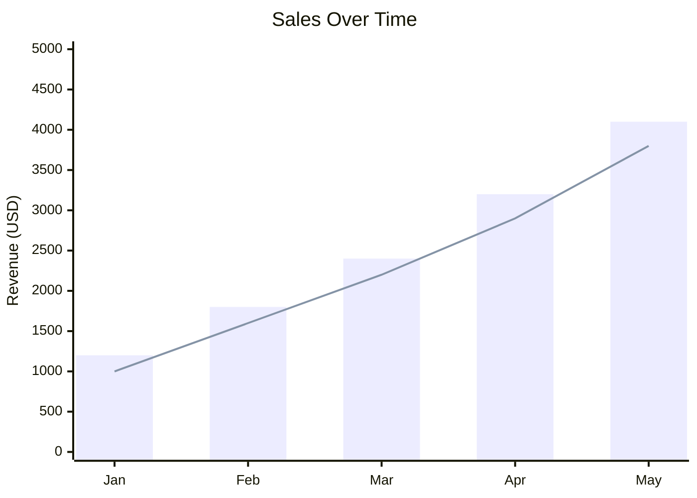

### Packet Diagram

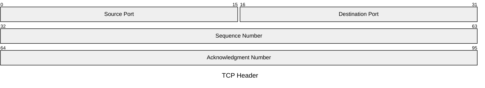

### Sankey Diagram

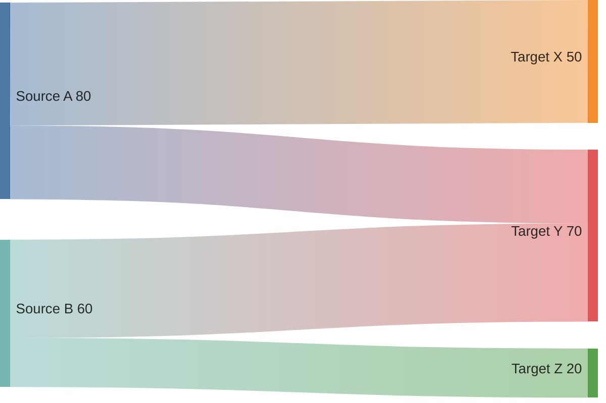

### Requirement Diagram

```mermaid
requirementDiagram
    requirement req1 {
        id: 1
        text: System shall authenticate users
        risk: high
        verifymethod: test
    }
    element test_suite {
        type: test case
    }
    test_suite - verifies -> req1
```

### C4 Context Diagram

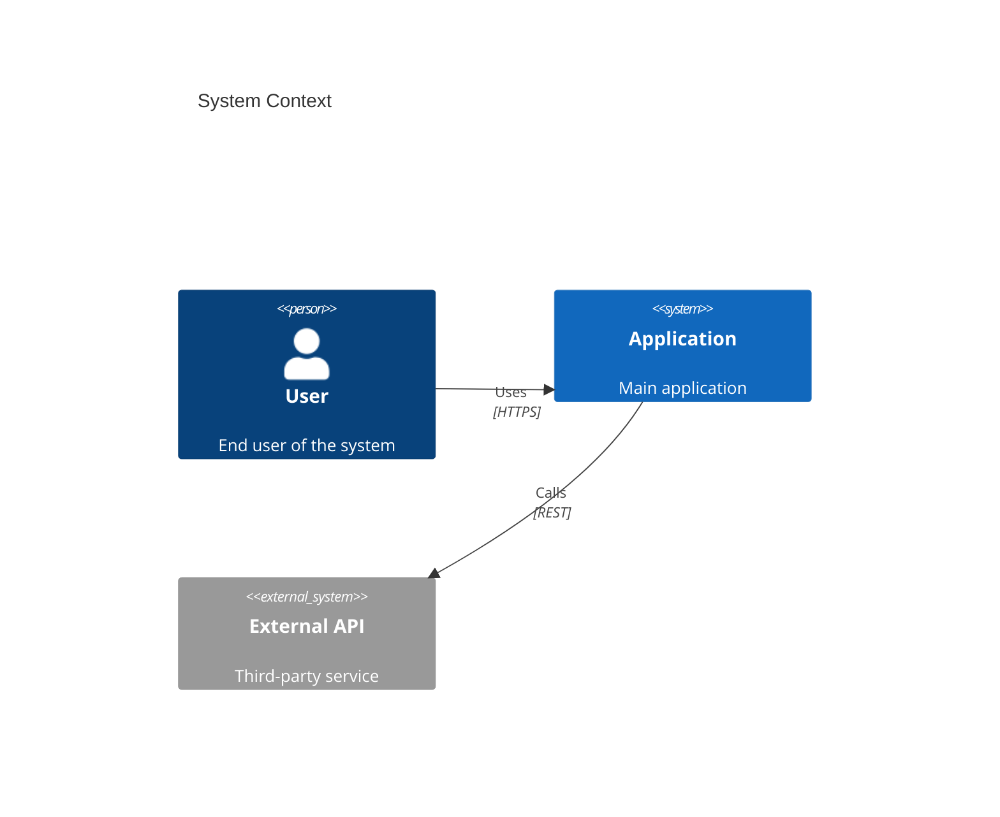

### User Journey

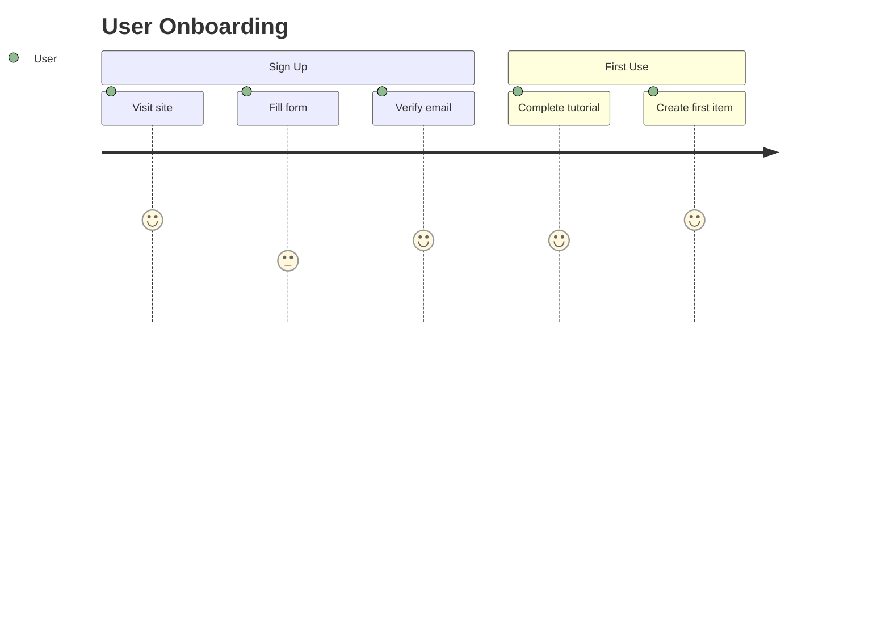

## Styling and Theming

### Class-based Styling (Flowcharts)

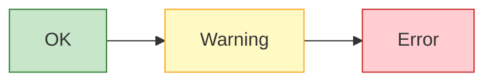

### Inline Styling

```mermaid
flowchart LR
    A[Styled] --> B[Default]
    style A fill:#e1f5fe,stroke:#0277bd,stroke-width:2px
```

### Theme Configuration

Use `%%{init: {'theme': 'forest'}}%%` at the top of any diagram.
Available themes: `default`, `neutral`, `dark`, `forest`, `base`.

## Diagram Creation Guidelines

1. **Start simple** — get the structure right first, then add detail
2. **Choose direction wisely** — `LR` for sequences/timelines, `TD` for hierarchies
3. **Use subgraphs** to group related elements and reduce visual clutter
4. **Label edges** when the relationship isn't obvious from context
5. **Apply color sparingly** — to highlight categories or status, not to decorate
6. **Keep node text short** — use 2-4 words per node label
7. **Break large diagrams** into focused smaller ones rather than one massive diagram
8. **Quote special characters** — wrap text with parentheses, brackets, or colons in double quotes
9. **Avoid `end` as a node ID** — use `End`, `END`, or `finish` instead (reserved word)
10. **Test rendering** — verify the diagram renders in the target platform

## Instructions for Claude

When the user asks you to create a Mermaid diagram:

1. **Identify the diagram type** — match the user's request to the best diagram type from the table above

2. **Look up syntax if needed** — for newer/uncommon types (architecture, kanban, sankey, XY, packet, requirement, ZenUML) or advanced features, query Context7:
   - Tool: `mcp__plugin_compound-engineering_context7__query-docs`
   - `libraryId`: `/mermaid-js/mermaid`
   - `query`: describe the specific syntax you need

3. **Create the diagram** — write clean Mermaid code following the quick reference above

4. **Add context** — provide a brief explanation of what the diagram shows and any design choices you made

5. **Validate mentally** — check for:
   - Correct diagram declaration keyword
   - Balanced brackets and quotes
   - No reserved-word conflicts (`end` as node ID)
   - Proper arrow syntax for the diagram type
   - Labels on all non-obvious relationships

6. **Offer refinements** — suggest additions or alternative diagram types if relevant

If the user provides vague input like "diagram my system", ask clarifying questions about what aspect they want to visualize (architecture, data flow, state transitions, etc.) before creating the diagram.
